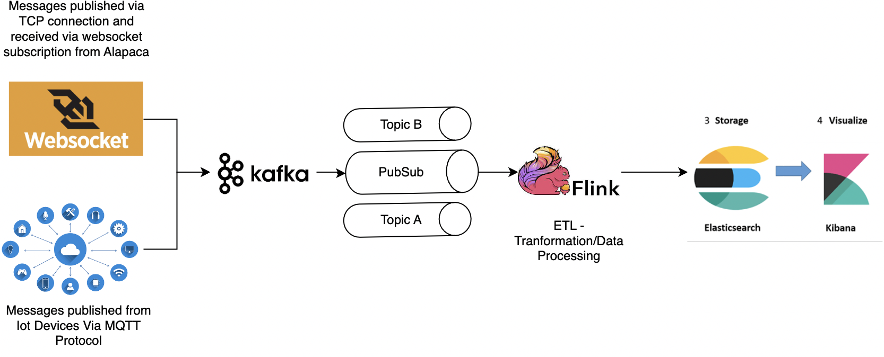
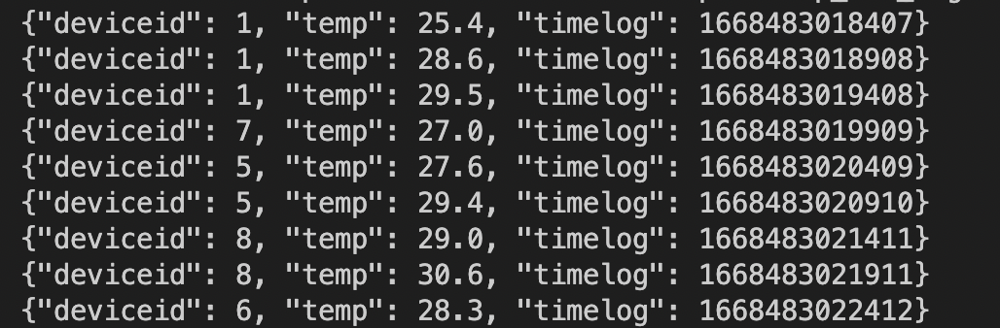

# Project Description

### Overall Architecture of Data Streaming Pipeline



### Visualisations from Kibana after data is stored in Elasticsearch


## Installation Requirements:
- Docker
- Python

## How to start up the system:
1. Run this command:
```
docker compose up -d
``` 
to run all relevant containers in headless mode

2. Once all of the containers are successfully running, check out the links to check if the services are running properly.
- Apache Flink UI: http://localhost:8081
- Elasticsearch service: http://localhost:9200
- Kibana dashboard: http://localhost:5601

3. Run this command to check if 'temp_iot_msg' topic is receiving message from iot data generator:
```
docker-compose exec kafka kafka-console-consumer.sh --bootstrap-server kafka:9092 --topic temp_iot_msg
```

<!--  -->


Similarly for topic 'crypto_msg', this should be seen in terminal:


4. Run this command to submit a flink job to process the real time data from kafka data stream source and push it into elasticsearch sink:
```
docker-compose exec jobmanager ./bin/flink run -py /opt/pyflink/temp_data.py -d
```

A job should be submitted as seen on 


Similarly for topic 'crypto_msg', this job can be submitted:
```
docker-compose exec jobmanager ./bin/flink run -py /opt/pyflink/crypto_msg_proccessing.py -d
```

## To Dos:
- [x] Set up Kafka data streams for data sources
- [ ] Data Source 1: Iot Devices sending Temperature
    - [x] Set up data generators for Iot Devices sending Temperature
    - [ ] Replace data generator with MQTT messages from AWS Kinesis Data Stream
- [x] Data Source 2: Crypto Data Stream
    - [x] Set up data generators
    - [x] Connect to Alapaca WSS crypto subscription for "BTCUSD", "ETHUSD" and "DOGEUSD" tokens.
- [ ] Apache Flink (Python version) for data processing
    - [x] Data processing 1 (Iot Devices sending Temperature)
    - [x] Data processing 2 (Crypto Data Stream)
    - [ ] Automate trading requests upon fulfilment of certain requirements - Trading system possibility (?)
- [ ] Apache Airflow (Automation Tool using Python version)
    - [ ] Automate retries and submission of new flink jobs upon failure 
    - [ ] Automate logging of errors
    - [ ] Automate adding of new data sources with only topic provided (?)
    


References: 
- *https://apache.googlesource.com/flink-playgrounds/+/HEAD/pyflink-walkthrough*
